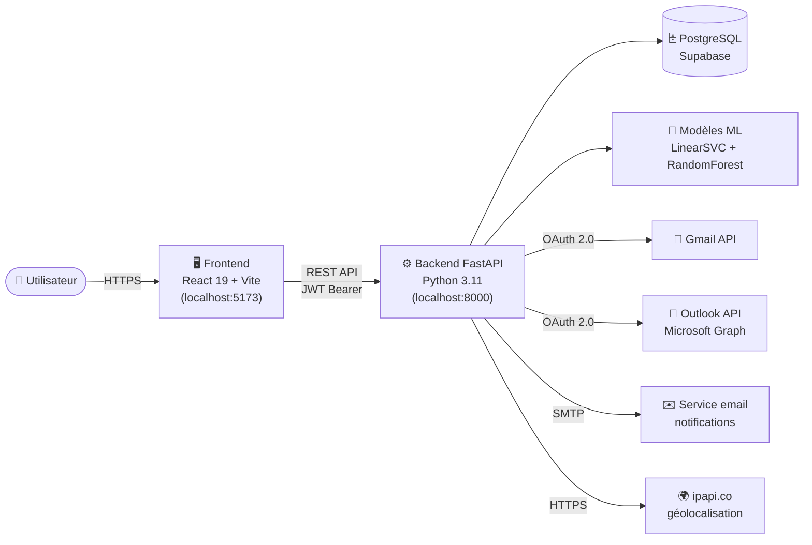
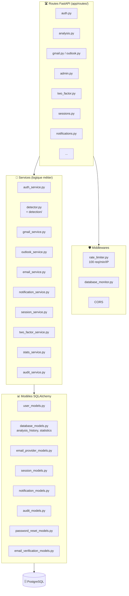
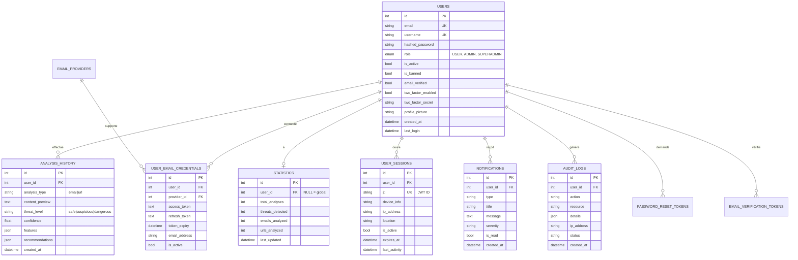
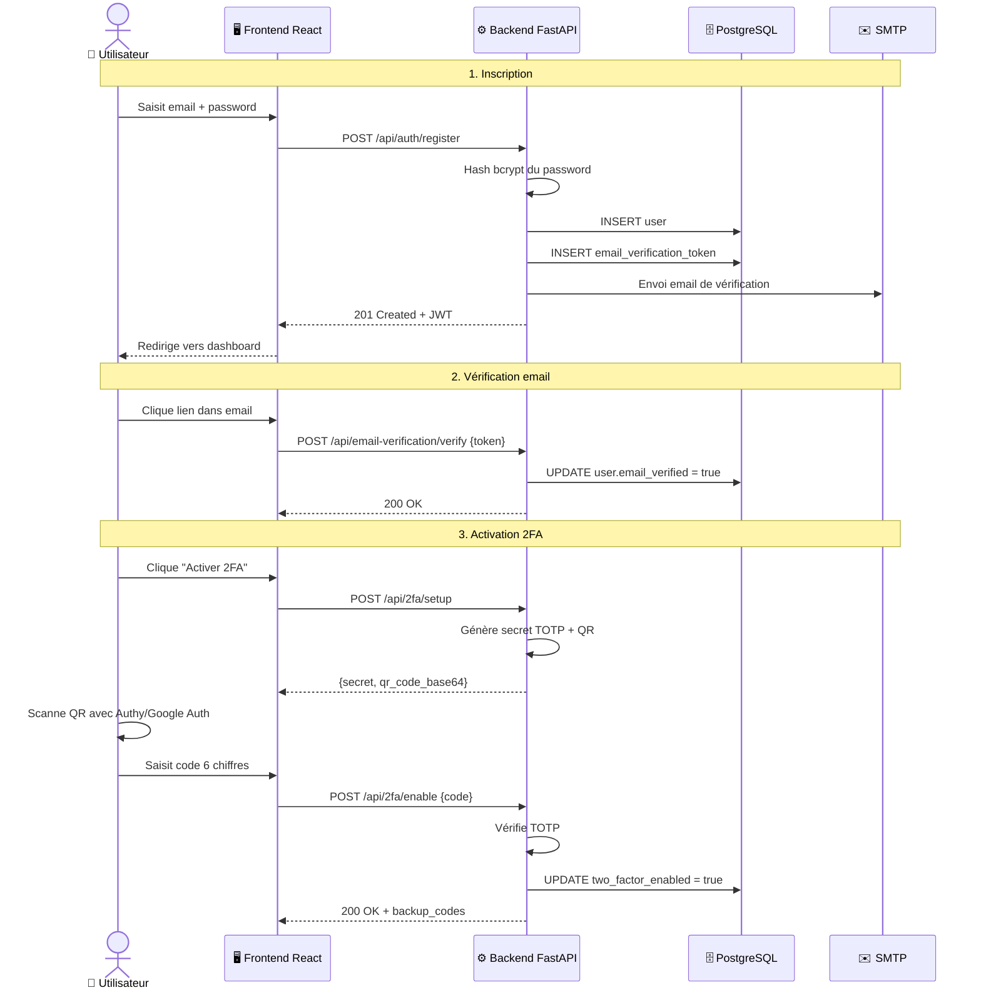
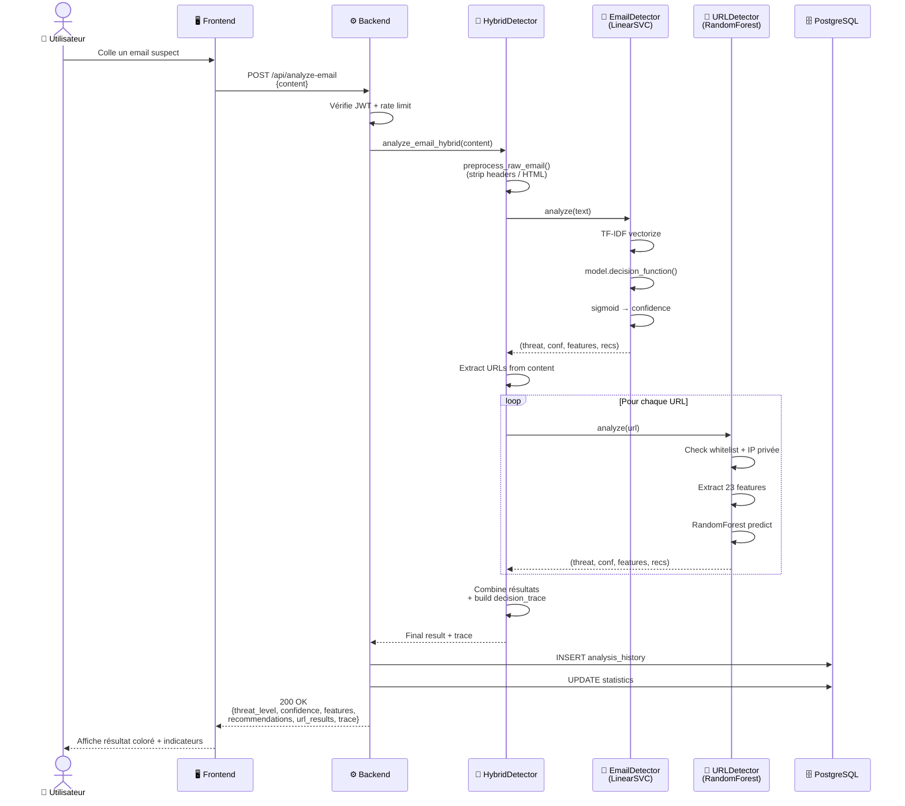
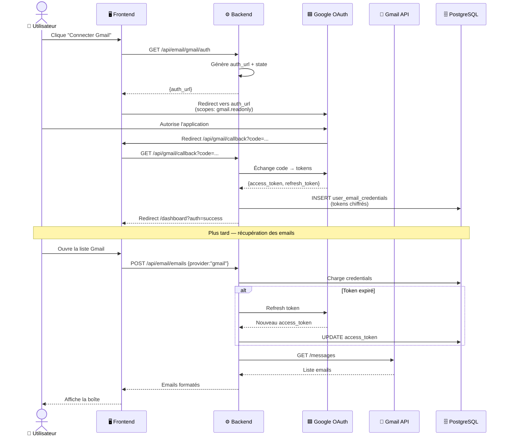
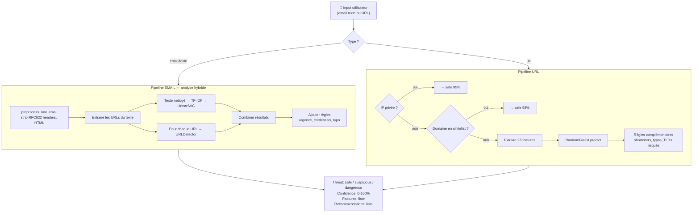
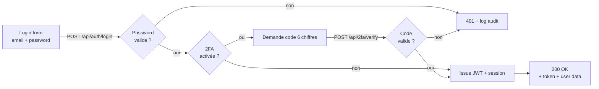
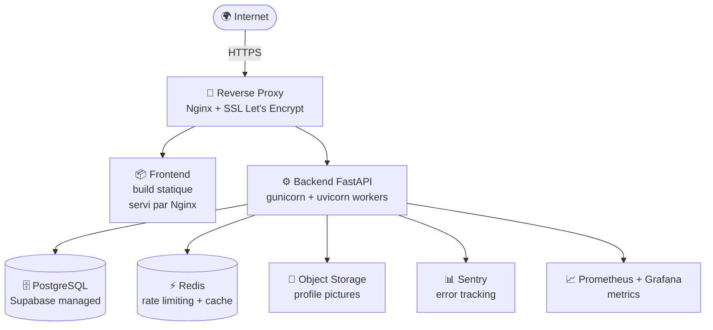

# 🏗️ Diagrammes d'Architecture — PhishGuard

> Tous les diagrammes sont en **Mermaid**. Ils s'affichent automatiquement sur GitHub et dans tous les éditeurs Markdown modernes (VS Code, Obsidian, Notion…).
> En cas de besoin pour les slides : copier le code, le coller sur https://mermaid.live et exporter en PNG/SVG.

---

## 1. Architecture globale (haut niveau)

---

## 2. Architecture en couches (backend)

---

## 3. Modèle de données (ER simplifié)

---

## 4. Séquence — Inscription + connexion + 2FA

---

## 5. Séquence — Analyse d'un email avec approche hybride

---

## 6. Séquence — Connexion à Gmail via OAuth 2.0

---

## 7. Diagramme de cas d'utilisation (use cases)

```mermaid
flowchart TB
    User([👤 Utilisateur])
    Admin([👑 Admin])

    subgraph Public ["Cas d'usage publics"]
        UC1[S'inscrire]
        UC2[Se connecter]
        UC3[Demander reset password]
        UC4[Vérifier email]
    end

    subgraph Auth ["Cas d'usage authentifiés"]
        UC5[Analyser un email]
        UC6[Analyser une URL]
        UC7[Analyse en masse]
        UC8[Connecter Gmail/Outlook]
        UC9[Voir l'historique]
        UC10[Voir le dashboard]
        UC11[Activer 2FA]
        UC12[Gérer ses sessions]
        UC13[Modifier son profil]
        UC14[Supprimer son compte]
    end

    subgraph Adm ["Cas d'usage admin"]
        UC15[Lister les utilisateurs]
        UC16[Bannir / débannir]
        UC17[Voir audit logs]
        UC18[Stats globales]
        UC19[Gérer rate limits]
        UC20[Voir tentatives brute force]
    end

    User --> UC1
    User --> UC2
    User --> UC3
    User --> UC4
    User --> UC5
    User --> UC6
    User --> UC7
    User --> UC8
    User --> UC9
    User --> UC10
    User --> UC11
    User --> UC12
    User --> UC13
    User --> UC14

    Admin --> UC15
    Admin --> UC16
    Admin --> UC17
    Admin --> UC18
    Admin --> UC19
    Admin --> UC20
```

---

## 8. Pipeline de détection ML (vue détaillée)

---

## 9. Flux d'authentification JWT + 2FA

---

## 10. Architecture de déploiement (cible production)

