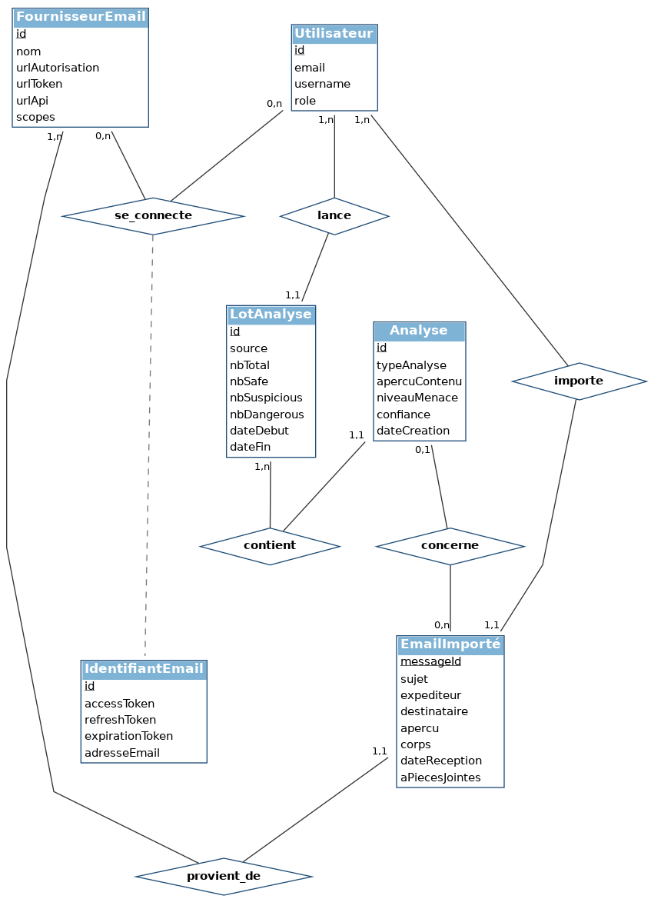

# MCD — Sprint 3 (Intégration Gmail / Outlook & traitement à grande échelle)

> Modèle Conceptuel de Données (MCD) — notation Merise pure (sans types techniques).
> À insérer dans la section **4.3.3 Conception de la base de données → Modèle conceptuel de données (MCD)** du rapport.

## Image du MCD



> Versions exportées dans `diagrammes/` :
> - `MCD_sprint3.png` — pour insertion dans Word / Markdown
> - `MCD_sprint3.pdf` — pour insertion vectorielle dans LaTeX (`\includegraphics`)
> - `MCD_sprint3.svg` — version vectorielle éditable (Inkscape, draw.io)
>
> Pour régénérer le diagramme : `python3 "préparation de soutenance technique/scripts/generate_mcd_sprint3.py"`

---

## Conventions de notation (Merise)

- **Entités** : rectangles avec en-tête bleu portant le nom de l'entité, suivi de la liste des attributs.
- **Identifiant** : attribut **souligné** (convention Merise pour la clé conceptuelle).
- **Aucun type technique** (pas de `Integer`, `String`, `(PK)`, `(FK)`…) : ces informations apparaissent au **MLD/MPD**, pas au MCD.
- **Associations** : losanges blancs portant un verbe (`se_connecte`, `importe`, `lance`, …).
- **Cardinalités** : `0,1` / `1,1` / `0,n` / `1,n` indiquées sur chaque branche.
- **Classe-association** : `IdentifiantEmail` est reliée à l'association `se_connecte` par un trait pointillé (notation Merise des associations qui portent des attributs).

---

## Périmètre couvert

Le MCD ne représente que les entités **directement impliquées dans les cas d'usage du sprint 3** :

| Cas d'usage du sprint 3 | Entités mobilisées |
|---|---|
| Connecter un compte Gmail / Outlook | `Utilisateur`, `FournisseurEmail`, `IdentifiantEmail` |
| Consulter sa boîte email & rechercher / filtrer | `Utilisateur`, `EmailImporté`, `FournisseurEmail` |
| Analyser des emails en masse (multi-sélection ou saisie manuelle) | `Utilisateur`, `LotAnalyse`, `Analyse`, `EmailImporté` |

**Entités volontairement exclues** :
- `JournalAudit` → entité purement technique (sécurité / conformité), absente des cas d'usage.
- `Notification`, `Statistique` → non visibles dans les cas d'usage du sprint 3 (elles seront représentées dans le MCD global du système, pas celui du sprint).

---

## Description des entités (6)

### `Utilisateur`
> Représentation **focalisée sur le sprint 3** : seuls les attributs utilisés
> par les cas d'usage de ce sprint sont conservés (les autres — auth, 2FA,
> profil, etc. — appartiennent au MCD du sprint 1).

| Attribut | Rôle |
|---|---|
| <u>id</u> | Identifiant |
| email | Adresse email du compte (référence pour OAuth, notification d'utilisateur) |
| username | Pseudo affiché |
| role | Rôle de l'acteur (utilisateur, administrateur, super-administrateur) — cf. Table 4.3 et 4.4 du rapport |

### `FournisseurEmail` *(nouveau — sprint 3)*
| Attribut | Rôle |
|---|---|
| <u>id</u> | Identifiant |
| nom | Nom du fournisseur (Gmail, Outlook…) |
| urlAutorisation | URL d'autorisation OAuth |
| urlToken | URL d'échange du code → token |
| urlApi | Endpoint API du fournisseur |
| scopes | Permissions demandées |

### `IdentifiantEmail` *(nouveau — sprint 3, classe-association)*
| Attribut | Rôle |
|---|---|
| <u>id</u> | Identifiant |
| accessToken | Jeton d'accès court terme |
| refreshToken | Jeton de rafraîchissement long terme |
| expirationToken | Date d'expiration du token (utilisée pour le refresh) |
| adresseEmail | Adresse email du compte connecté |

> Cette classe-association lie un `Utilisateur` à un `FournisseurEmail` et porte les jetons OAuth.

### `EmailImporté` *(nouveau — sprint 3)*
| Attribut | Rôle |
|---|---|
| <u>messageId</u> | Identifiant du message côté fournisseur |
| sujet | Objet de l'email |
| expediteur | Adresse de l'expéditeur |
| destinataire | Adresse du destinataire |
| apercu | Aperçu textuel |
| corps | Contenu |
| dateReception | Horodatage de réception |
| aPiecesJointes | Présence de pièces jointes |

### `LotAnalyse` *(nouveau — sprint 3)*
| Attribut | Rôle |
|---|---|
| <u>id</u> | Identifiant |
| source | Origine du lot (manuel / gmail / outlook) |
| nbTotal | Nombre d'éléments analysés |
| nbSafe | Compteur Safe |
| nbSuspicious | Compteur Suspicious |
| nbDangerous | Compteur Dangerous |
| dateDebut | Début de l'analyse en masse |
| dateFin | Fin de l'analyse en masse |

### `Analyse`
| Attribut | Rôle |
|---|---|
| <u>id</u> | Identifiant |
| typeAnalyse | Type d'analyse (en sprint 3, toujours `email`) |
| apercuContenu | Aperçu du contenu analysé (visible dans le détail bloc par bloc) |
| niveauMenace | Niveau de menace (safe / suspicious / dangerous) |
| confiance | Score de confiance |
| dateCreation | Date de l'analyse (ordre d'affichage dans le rapport) |

---

## Description des associations (6)

| Association | E1 (cardinalité) | Verbe | E2 (cardinalité) | Sens métier |
|---|---|---|---|---|
| **se_connecte** | `Utilisateur` (0,n) | se_connecte | `FournisseurEmail` (0,n) | Un utilisateur peut connecter plusieurs fournisseurs ; un fournisseur peut être connecté par plusieurs utilisateurs. La classe-association **`IdentifiantEmail`** porte les jetons OAuth. |
| **importe** | `Utilisateur` (1,n) | importe | `EmailImporté` (1,1) | Tout email importé l'est par un et un seul utilisateur. |
| **provient_de** | `EmailImporté` (1,1) | provient_de | `FournisseurEmail` (1,n) | Chaque email importé vient d'un seul fournisseur. |
| **lance** | `Utilisateur` (1,n) | lance | `LotAnalyse` (1,1) | Un utilisateur lance plusieurs lots ; un lot a un seul lanceur. |
| **contient** | `LotAnalyse` (1,n) | contient | `Analyse` (1,1) | Un lot contient plusieurs analyses ; en sprint 3 toute analyse appartient à un lot (l'auteur de l'analyse se déduit du lot via `lance`). |
| **concerne** | `Analyse` (0,1) | concerne | `EmailImporté` (0,n) | Une analyse peut concerner un email importé OU un contenu manuel collé (donc 0,1). |

---

## Choix de modélisation justifiés

1. **Périmètre limité aux 6 entités du sprint 3** — Le MCD d'un sprint ne représente que les concepts métier impactés par ce sprint. Les entités transverses (`Notification`, `Statistique`, `JournalAudit`) sont représentées dans le MCD global du système, pas ici.
2. **`IdentifiantEmail` modélisée en classe-association** — Les attributs (jetons, expiration, adresse email connectée) n'ont de sens **que** dans le contexte de la relation entre un utilisateur et un fournisseur. C'est l'usage canonique d'une classe-association en Merise.
3. **`EmailImporté` modélisé conceptuellement** — Le MCD est un modèle métier, pas physique. Un utilisateur **manipule** ses emails même s'ils ne sont pas persistés en base : ils transitent via les API Gmail / Microsoft Graph.
4. **`LotAnalyse` séparé d'`Analyse`** — Permet de représenter le rapport agrégé du cas d'usage « analyser en masse » et de tracer l'origine du lot (manuel, gmail, outlook).
5. **Cardinalité `(1,1)` sur `Analyse → LotAnalyse`** — En sprint 3, toute analyse est issue d'un lot (multi-sélection ou saisie manuelle de Table 4.6). L'auteur de l'analyse se déduit du lot, ce qui rend une association directe `effectue` redondante.
6. **Attributs limités au strict nécessaire** — Les métadonnées techniques (dateCreation/dateMiseAJour des tokens, estActif d'un fournisseur, caractéristiques/recommandations ML internes) sont absentes : elles n'apparaissent dans aucun cas d'usage du sprint.

---

## Snippet LaTeX prêt à coller

```latex
\subsection*{Modèle conceptuel de données (MCD)}

Cette section présente l'évolution du schéma de base de données, en mettant
l'accent sur les aspects conceptuels modélisés durant ce sprint.

\begin{figure}[H]
    \centering
    \includegraphics[width=\textwidth]{figures/MCD_sprint3.pdf}
    \caption{Modèle Conceptuel de Données du sprint 3}
    \label{fig:mcd_sprint3}
\end{figure}

Le MCD (figure~\ref{fig:mcd_sprint3}) se concentre sur les concepts métier
manipulés durant le sprint 3 : la connexion OAuth aux fournisseurs email
(\textbf{FournisseurEmail}, classe-association \textbf{IdentifiantEmail}
portant les jetons), l'importation et la consultation des messages
(\textbf{EmailImporté}) ainsi que l'analyse en masse organisée en lots
(\textbf{LotAnalyse}, \textbf{Analyse}).
```

> Copier `diagrammes/MCD_sprint3.pdf` dans le dossier `figures/` du projet LaTeX.

---

## Diagramme alternatif Mermaid (intégration Markdown / GitHub)

```mermaid
erDiagram
    Utilisateur ||--o{ IdentifiantEmail : "se connecte (OAuth)"
    FournisseurEmail ||--o{ IdentifiantEmail : "supporte"
    Utilisateur ||--o{ EmailImporte : "importe"
    FournisseurEmail ||--o{ EmailImporte : "fournit"
    Utilisateur ||--o{ LotAnalyse : "lance"
    LotAnalyse ||--|{ Analyse : "contient"
    Analyse }o--o| EmailImporte : "concerne"

    Utilisateur {
        id PK
        email
        username
        role
    }
    FournisseurEmail {
        id PK
        nom
        urlAutorisation
        urlToken
        urlApi
        scopes
    }
    IdentifiantEmail {
        id PK
        accessToken
        refreshToken
        expirationToken
        adresseEmail
    }
    EmailImporte {
        messageId PK
        sujet
        expediteur
        destinataire
        apercu
        corps
        dateReception
        aPiecesJointes
    }
    LotAnalyse {
        id PK
        source
        nbTotal
        nbSafe
        nbSuspicious
        nbDangerous
        dateDebut
        dateFin
    }
    Analyse {
        id PK
        typeAnalyse
        apercuContenu
        niveauMenace
        confiance
        dateCreation
    }
```

---

## Étapes suivantes (hors scope MCD)

Si tu veux aller plus loin :
- **MLD (Modèle Logique de Données)** : passage en relations (tables) avec clés étrangères.
- **MPD / Script SQL** : `CREATE TABLE` PostgreSQL pour les nouvelles tables (`email_providers`, `user_email_credentials`, `bulk_analysis_jobs`) + migration Alembic.
