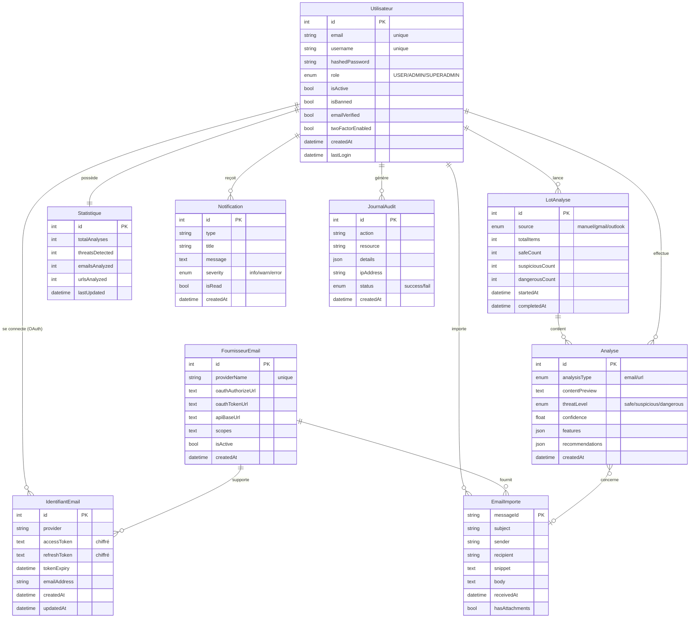

# MCD — Sprint 3 (Intégration Gmail / Outlook & traitement à grande échelle)

> Modèle Conceptuel de Données (MCD) — notation Merise.
> À insérer dans la section **4.3.3 Conception de la base de données → Modèle conceptuel de données (MCD)** du rapport.

## Image du MCD


> Versions exportées disponibles dans `diagrammes/` :
> - `MCD_sprint3.png` — pour insertion dans Word / Markdown
> - `MCD_sprint3.pdf` — pour insertion vectorielle dans LaTeX (`\includegraphics`)
> - `MCD_sprint3.svg` — version vectorielle éditable (Inkscape, draw.io, Illustrator)
>
> Pour régénérer le diagramme : `python3 "préparation de soutenance technique/scripts/generate_mcd_sprint3.py"`

---

## Périmètre couvert par ce MCD

Le sprint 3 introduit dans la base de données :

1. **L'intégration multi-fournisseurs OAuth 2.0** (Gmail, Outlook) → 2 nouvelles tables :
   - `email_providers` (catalogue des fournisseurs supportés)
   - `user_email_credentials` (jetons OAuth chiffrés par utilisateur)
2. **L'analyse en masse** (multi-sélection depuis la boîte connectée OU saisie manuelle) → introduction conceptuelle d'un **lot d'analyses** (`LotAnalyse`) qui agrège des entrées d'`AnalysisHistory`.
3. **La consultation de la boîte email** → entité conceptuelle `EmailImporté` (les messages ne sont pas persistés dans la base sauf prévisualisation, ils transitent en cache via les API Gmail / Microsoft Graph, mais sont représentés au niveau conceptuel pour exprimer les associations métier).

Les entités déjà présentes des sprints précédents (`Utilisateur`, `Statistique`, `Notification`, `JournalAudit`) sont **réutilisées et non modifiées** ; elles apparaissent dans le MCD pour montrer leur articulation avec les nouveautés du sprint.

---

## Description des entités

### `Utilisateur`
| Attribut             | Type                                    | Rôle |
|----------------------|------------------------------------------|------|
| **id** (PK)          | Integer                                  | Identifiant interne |
| email                | String (unique)                          | Adresse de connexion |
| username             | String (unique)                          | Pseudo affiché |
| hashedPassword       | String                                   | Mot de passe haché (bcrypt) |
| role                 | Enum (USER / ADMIN / SUPERADMIN)         | Rôle de l'acteur (RBAC) |
| isActive, isBanned   | Boolean                                  | États du compte |
| emailVerified        | Boolean                                  | Compte validé par OTP |
| twoFactorEnabled     | Boolean                                  | TOTP activé |
| profilePicture       | String                                   | URL avatar |
| createdAt, lastLogin | DateTime                                 | Traçabilité temporelle |

### `FournisseurEmail`  *(nouveau — sprint 3)*
| Attribut             | Type                | Rôle |
|----------------------|---------------------|------|
| **id** (PK)          | Integer             | Identifiant interne |
| providerName         | String (unique)     | `gmail`, `outlook`, … |
| oauthAuthorizeUrl    | Text                | URL d'autorisation OAuth 2.0 |
| oauthTokenUrl        | Text                | URL d'échange code → token |
| apiBaseUrl           | Text                | Endpoint API (Gmail API / Microsoft Graph) |
| scopes               | Text                | Permissions demandées (`gmail.readonly`, `Mail.Read`…) |
| isActive             | Boolean             | Activable / désactivable par l'admin |
| createdAt            | DateTime            | Date d'enregistrement |

### `IdentifiantEmail`  *(nouveau — sprint 3, classe-association)*
| Attribut          | Type                | Rôle |
|-------------------|---------------------|------|
| **id** (PK)       | Integer             | Identifiant interne |
| provider          | String              | Nom du fournisseur (cohérence avec `FournisseurEmail.providerName`) |
| accessToken       | Text **(chiffré)**  | Jeton d'accès court terme |
| refreshToken      | Text **(chiffré)**  | Jeton de rafraîchissement long terme |
| tokenExpiry       | DateTime            | Expiration de l'access token |
| emailAddress      | String              | Adresse email du compte connecté |
| createdAt, updatedAt | DateTime         | Audit |

> **Contrainte d'unicité** : `(user_id, provider)` — un utilisateur ne peut connecter **qu'un seul** compte par fournisseur.
> **Sécurité** : les tokens sont chiffrés au repos via Fernet/AES (clé `EMAIL_TOKEN_ENCRYPTION_KEY`).

### `EmailImporté`  *(entité conceptuelle — sprint 3)*
Représente un message email récupéré depuis la boîte connectée. Au niveau **conceptuel**, il a des attributs ; au niveau **logique/physique**, seul un cache léger ou les analyses dérivées sont persistés (les emails restent côté fournisseur).

| Attribut          | Type      | Rôle |
|-------------------|-----------|------|
| **messageId** (PK)| String    | ID natif Gmail / Outlook |
| subject           | String    | Sujet |
| sender, recipient | String    | Adresses |
| snippet           | Text      | Aperçu |
| body              | Text      | Contenu (récupéré à la demande) |
| receivedAt        | DateTime  | Horodatage |
| hasAttachments    | Boolean   | Présence de pièces jointes |

### `LotAnalyse`  *(nouveau — sprint 3)*
Regroupe les analyses lancées d'un coup (multi-sélection ≤ 50 emails OU coller-coller manuel ≤ 50 blocs). Permet de produire le rapport agrégé exigé par le cas d'usage *« Analyser des emails en masse »*.

| Attribut            | Type                           | Rôle |
|---------------------|--------------------------------|------|
| **id** (PK)         | Integer                        | Identifiant interne |
| source              | Enum (`manuel`/`gmail`/`outlook`) | Origine du lot |
| totalItems          | Integer                        | Nombre d'éléments |
| safeCount           | Integer                        | Compteur Safe |
| suspiciousCount     | Integer                        | Compteur Suspicious |
| dangerousCount      | Integer                        | Compteur Dangerous |
| startedAt, completedAt | DateTime                    | Bornes temporelles |

### `Analyse`
Une ligne de l'historique d'analyse (existant — table `analysis_history`, réutilisée pour le sprint 3).

| Attribut          | Type                                              |
|-------------------|---------------------------------------------------|
| **id** (PK)       | Integer                                           |
| analysisType      | Enum (`email` / `url`)                            |
| contentPreview    | Text                                              |
| threatLevel       | Enum (`safe` / `suspicious` / `dangerous`)        |
| confidence        | Float                                             |
| features          | JSON                                              |
| recommendations   | JSON                                              |
| createdAt         | DateTime                                          |

### `Statistique`, `Notification`, `JournalAudit`
Entités déjà existantes (sprint 1 / 2). Conservées et alimentées par les nouveaux flux du sprint 3 :
- une connexion OAuth réussie crée une `Notification` et une entrée `JournalAudit` ;
- chaque `Analyse` met à jour la `Statistique` de l'utilisateur **et** la statistique globale.

---

## Description des associations

| Association     | E1 (cardinalité)            | Verbe         | E2 (cardinalité)              | Sens métier |
|-----------------|------------------------------|----------------|-------------------------------|-------------|
| **se_connecte**\* | `Utilisateur` (0,n)        | se_connecte   | `FournisseurEmail` (0,n)      | Un utilisateur peut connecter 0..n fournisseurs ; un fournisseur peut être connecté par 0..n utilisateurs. La classe-association **`IdentifiantEmail`** porte les attributs (tokens). |
| **importe**       | `Utilisateur` (1,n)        | importe       | `EmailImporté` (1,1)          | Tout email importé l'est par un et un seul utilisateur. |
| **provient_de**   | `EmailImporté` (1,1)       | provient_de   | `FournisseurEmail` (1,n)      | Chaque email importé vient d'exactement un fournisseur. |
| **lance**         | `Utilisateur` (1,n)        | lance         | `LotAnalyse` (1,1)            | Un utilisateur lance plusieurs lots ; un lot a un seul lanceur. |
| **contient**      | `LotAnalyse` (1,n)         | contient      | `Analyse` (0,1)               | Un lot contient n analyses ; une analyse appartient au plus à un lot (les analyses individuelles ad-hoc ont 0 lot). |
| **effectue**      | `Utilisateur` (1,n)        | effectue      | `Analyse` (1,1)               | Toute analyse a un auteur. |
| **concerne**      | `Analyse` (0,1)            | concerne      | `EmailImporté` (0,n)          | Une analyse peut porter sur un email importé OU sur un contenu manuel (0,1). |
| **possède**       | `Utilisateur` (1,1)        | possède       | `Statistique` (1,1)           | Une statistique par utilisateur (singleton + ligne globale). |
| **reçoit**        | `Utilisateur` (1,n)        | reçoit        | `Notification` (1,1)          | Notifications dédiées à un destinataire. |
| **génère**        | `Utilisateur` (1,n)        | génère        | `JournalAudit` (1,1)          | Toute action sensible est tracée. |

\* La classe-association `IdentifiantEmail` est l'élément le plus important du sprint 3 : c'est elle qui matérialise la **persistance des jetons OAuth** d'un utilisateur pour un fournisseur donné.

---

## Choix de modélisation justifiés

1. **`IdentifiantEmail` en classe-association plutôt qu'entité indépendante** — Conformément à la sémantique Merise : les attributs (tokens, expiration, email connecté) n'ont de sens que **dans le contexte de la relation** entre un utilisateur et un fournisseur. La contrainte UNIQUE `(user_id, provider)` garantit qu'on n'a qu'un identifiant par couple.
2. **`EmailImporté` modélisé conceptuellement même s'il n'est pas persisté** — Le MCD est un modèle **métier**, pas physique. On veut exprimer que « un email importé provient d'un fournisseur et est analysé par un utilisateur ». Au niveau MLD/MPD, on peut choisir de ne stocker qu'un cache (table `email_cache`) ou de ne rien persister du tout.
3. **`LotAnalyse` séparé d'`Analyse`** — Permet :
   - d'agréger immédiatement les compteurs (sans recalcul à chaque affichage du rapport agrégé) ;
   - de tracer la source du lot (`gmail`, `outlook`, `manuel`) — utile pour les statistiques d'usage par fournisseur.
4. **Cardinalités `(0,1)` sur `Analyse → LotAnalyse`** — Permet de conserver les analyses unitaires (sprints 1 et 2) sans les forcer dans un lot fictif.

---

## Diagramme alternatif Mermaid (intégration Markdown / GitHub)



---

## Snippet LaTeX prêt à coller

```latex
\subsection*{Modèle conceptuel de données (MCD)}

Cette section présente l'évolution du schéma de base de données, en mettant
l'accent sur les aspects conceptuels modélisés durant ce sprint.

\begin{figure}[H]
    \centering
    \includegraphics[width=\textwidth]{figures/MCD_sprint3.pdf}
    \caption{Modèle Conceptuel de Données du sprint 3}
    \label{fig:mcd_sprint3}
\end{figure}

Le MCD (figure~\ref{fig:mcd_sprint3}) introduit deux entités majeures pour
ce sprint : \textbf{FournisseurEmail} (catalogue des fournisseurs supportés
- Gmail, Outlook) et \textbf{IdentifiantEmail} (classe-association portant
les jetons OAuth chiffrés liant un utilisateur à un fournisseur). L'entité
\textbf{LotAnalyse} agrège les analyses lancées en masse, tandis que
\textbf{EmailImporté} représente conceptuellement les messages récupérés
via les API Gmail et Microsoft Graph.
```

> Copier `diagrammes/MCD_sprint3.pdf` dans le dossier `figures/` du projet LaTeX.

---

## Points à valider avec toi

Si tu veux que j'ajuste, voici les choix que j'ai faits **par défaut** et qui méritent peut-être un retour de ta part :

1. **`EmailImporté` est-il persisté en base ?** J'ai choisi de le modéliser au niveau conceptuel sans le persister (les emails transitent en cache). Si tu veux les stocker (table `email_cache`), dis-le moi et je rajoute les attributs/index nécessaires.
2. **`LotAnalyse` n'existe pas encore dans le code backend.** Je l'ai introduit pour donner un sens métier à la fonctionnalité « analyse en masse ». Veux-tu que je crée la table SQL correspondante (MLD/MPD du sprint 3) ?
3. **Cas du SuperAdmin** : il n'est pas représenté comme entité distincte (différent de l'exemple fourni où Admin était séparé) — j'ai préféré utiliser un attribut `role` sur `Utilisateur` car c'est ce que fait ton code (cf. `User.role` dans `user_models.py`). Si tu préfères deux entités distinctes (`Utilisateur` / `Administrateur`), je modifie.
4. **Veux-tu que j'ajoute aussi le MLD (Modèle Logique de Données)** — passage en tables relationnelles avec clés étrangères ? C'est l'étape suivante naturelle après le MCD.
