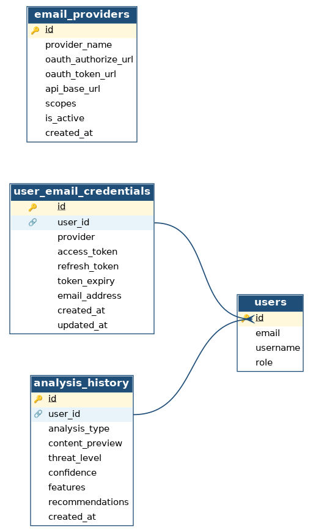

# MLD — Sprint 3 (Intégration Gmail / Outlook & traitement à grande échelle)

> Modèle Logique de Données (MLD) — traduction relationnelle du MCD du sprint 3.
> À insérer dans la section **4.3.3 Conception de la base de données → Modèle logique de données (MLD)** du rapport.

## Image du MLD



> Versions exportées dans `diagrammes/` :
> - `MLD_sprint3.png` — pour insertion dans Word / Markdown
> - `MLD_sprint3.pdf` — pour insertion vectorielle dans LaTeX (`\includegraphics`)
> - `MLD_sprint3.svg` — version vectorielle éditable
>
> Pour régénérer le diagramme : `python3 "préparation de soutenance technique/scripts/generate_mld_sprint3.py"`

---

## Conventions de notation

- **Tables** : nom en `snake_case`, énumération des attributs entre parenthèses.
- **Clé primaire (PK)** : déclarée explicitement avec son type logique.
- **Clé étrangère (FK)** : listée dans la rubrique `Relations` avec la table référencée.
- **Contraintes** : domaine de valeurs, unicité, nullabilité — listées dans la rubrique `Contraintes`.

---

## Règles de passage MCD → MLD appliquées

| Règle Merise | Application sprint 3 |
|---|---|
| Une **entité** devient une **table** ; son identifiant devient la **PK**. | `utilisateur`, `fournisseur_email`, `email_importe`, `lot_analyse`, `analyse` |
| Une **association (1,n) — (1,1)** se traduit par une **FK** dans la table côté « 1,1 ». | `email_importe.id_utilisateur`, `email_importe.id_fournisseur`, `lot_analyse.id_utilisateur`, `analyse.id_lot` |
| Une **association (0,1) — (0,n)** se traduit par une **FK NULLABLE** dans la table côté « 0,1 ». | `analyse.message_id` (NULLABLE car analyse manuelle = pas d'email source) |
| Une **classe-association (n,n)** devient une **table dédiée** avec FK vers chaque entité + ses propres attributs. | `identifiant_email` |

---

## Description des relations (6)

### 1. utilisateur
```
(id_utilisateur, email, username, role)
```
**Clé primaire :** `id_utilisateur` (INTEGER, auto-incrémenté)

**Contraintes :**
- `email` UNIQUE NOT NULL
- `username` UNIQUE NOT NULL
- `role` ∈ {`USER`, `ADMIN`, `SUPERADMIN`}

---

### 2. fournisseur_email
```
(id_fournisseur, nom, url_autorisation, url_token, url_api, scopes)
```
**Clé primaire :** `id_fournisseur` (INTEGER, auto-incrémenté)

**Contraintes :**
- `nom` UNIQUE NOT NULL
- `nom` ∈ {`gmail`, `outlook`}

---

### 3. identifiant_email *(table dédiée — issue de la classe-association)*
```
(id_identifiant, id_utilisateur, id_fournisseur,
 access_token, refresh_token, expiration_token,
 adresse_email)
```
**Clé primaire :** `id_identifiant` (INTEGER, auto-incrémenté)

**Relations :**
- `id_utilisateur` → Référence vers `utilisateur`
- `id_fournisseur` → Référence vers `fournisseur_email`

**Contraintes :**
- `UNIQUE(id_utilisateur, id_fournisseur)` — un utilisateur ne peut connecter qu'un seul compte par fournisseur
- `access_token`, `refresh_token` chiffrés au niveau applicatif (Fernet / AES-GCM)
- `expiration_token` NOT NULL

---

### 4. email_importe
```
(message_id, id_utilisateur, id_fournisseur,
 sujet, expediteur, destinataire,
 apercu, corps,
 date_reception, a_pieces_jointes)
```
**Clé primaire :** `message_id` (VARCHAR — identifiant du message côté fournisseur)

**Relations :**
- `id_utilisateur` → Référence vers `utilisateur`
- `id_fournisseur` → Référence vers `fournisseur_email`

**Contraintes :**
- `expediteur`, `destinataire` NOT NULL (format email)
- `a_pieces_jointes` BOOLEAN — défaut `false`

---

### 5. lot_analyse
```
(id_lot, id_utilisateur,
 source, nb_total,
 nb_safe, nb_suspicious, nb_dangerous,
 date_debut, date_fin)
```
**Clé primaire :** `id_lot` (INTEGER, auto-incrémenté)

**Relations :**
- `id_utilisateur` → Référence vers `utilisateur` (lanceur du lot)

**Contraintes :**
- `source` ∈ {`manuel`, `gmail`, `outlook`}
- `nb_total = nb_safe + nb_suspicious + nb_dangerous` (cohérence des compteurs)
- `date_fin >= date_debut`

---

### 6. analyse
```
(id_analyse, id_lot, message_id,
 type_analyse, apercu_contenu,
 niveau_menace, confiance,
 date_creation)
```
**Clé primaire :** `id_analyse` (INTEGER, auto-incrémenté)

**Relations :**
- `id_lot` → Référence vers `lot_analyse` (NOT NULL — toute analyse appartient à un lot)
- `message_id` → Référence vers `email_importe` (NULLABLE — NULL pour les analyses issues d'une saisie manuelle)

**Contraintes :**
- `type_analyse` ∈ {`email`} (en sprint 3 : email uniquement)
- `niveau_menace` ∈ {`safe`, `suspicious`, `dangerous`}
- `confiance` ∈ [0, 1] (FLOAT)

---

## Schéma textuel récapitulatif

```
utilisateur          (#id_utilisateur, email, username, role)
fournisseur_email    (#id_fournisseur, nom, url_autorisation, url_token, url_api, scopes)
identifiant_email    (#id_identifiant,
                      #id_utilisateur → utilisateur.id_utilisateur,
                      #id_fournisseur → fournisseur_email.id_fournisseur,
                      access_token, refresh_token, expiration_token, adresse_email,
                      UNIQUE(id_utilisateur, id_fournisseur))
email_importe        (#message_id,
                      #id_utilisateur → utilisateur.id_utilisateur,
                      #id_fournisseur → fournisseur_email.id_fournisseur,
                      sujet, expediteur, destinataire, apercu, corps,
                      date_reception, a_pieces_jointes)
lot_analyse          (#id_lot,
                      #id_utilisateur → utilisateur.id_utilisateur,
                      source, nb_total, nb_safe, nb_suspicious, nb_dangerous,
                      date_debut, date_fin)
analyse              (#id_analyse,
                      #id_lot → lot_analyse.id_lot,
                      #message_id → email_importe.message_id  (NULL OK),
                      type_analyse, apercu_contenu, niveau_menace,
                      confiance, date_creation)
```

---

## Traçabilité MCD → MLD

| MCD (entité ou association) | MLD (table ou colonne FK) |
|---|---|
| Entité `Utilisateur` | Table `utilisateur` |
| Entité `FournisseurEmail` | Table `fournisseur_email` |
| Classe-association `IdentifiantEmail` (n,n entre Utilisateur et FournisseurEmail) | Table `identifiant_email` + 2 FK + UNIQUE |
| Entité `EmailImporté` | Table `email_importe` |
| Entité `LotAnalyse` | Table `lot_analyse` |
| Entité `Analyse` | Table `analyse` |
| Association `se_connecte` | FKs dans `identifiant_email` |
| Association `importe` (1,1 / 1,n) | FK `email_importe.id_utilisateur` |
| Association `provient_de` (1,1 / 1,n) | FK `email_importe.id_fournisseur` |
| Association `lance` (1,1 / 1,n) | FK `lot_analyse.id_utilisateur` |
| Association `contient` (1,1 / 1,n) | FK `analyse.id_lot` (NOT NULL) |
| Association `concerne` (0,1 / 0,n) | FK `analyse.message_id` (NULLABLE) |

---

## Snippet LaTeX prêt à coller

```latex
\subsection*{Modèle logique de données (MLD)}

À partir du MCD précédent, nous avons procédé au passage au modèle logique
relationnel selon les règles classiques de Merise.

\begin{figure}[H]
    \centering
    \includegraphics[width=\textwidth]{figures/MLD_sprint3.pdf}
    \caption{Modèle Logique de Données du sprint 3}
    \label{fig:mld_sprint3}
\end{figure}

\paragraph{Description des relations.}

\begin{enumerate}
    \item \textbf{utilisateur}\\
    \texttt{(id\_utilisateur, email, username, role)}\\
    Clé primaire : \texttt{id\_utilisateur} (INTEGER)\\
    Contraintes :
    \begin{itemize}
        \item \texttt{email} UNIQUE NOT NULL
        \item \texttt{username} UNIQUE NOT NULL
        \item \texttt{role} $\in$ \{\texttt{USER}, \texttt{ADMIN}, \texttt{SUPERADMIN}\}
    \end{itemize}

    \item \textbf{fournisseur\_email}\\
    \texttt{(id\_fournisseur, nom, url\_autorisation, url\_token, url\_api, scopes)}\\
    Clé primaire : \texttt{id\_fournisseur} (INTEGER)\\
    Contraintes :
    \begin{itemize}
        \item \texttt{nom} UNIQUE
        \item \texttt{nom} $\in$ \{\texttt{gmail}, \texttt{outlook}\}
    \end{itemize}

    \item \textbf{identifiant\_email}\\
    \texttt{(id\_identifiant, id\_utilisateur, id\_fournisseur, access\_token, refresh\_token, expiration\_token, adresse\_email)}\\
    Clé primaire : \texttt{id\_identifiant} (INTEGER)\\
    Relations :
    \begin{itemize}
        \item \texttt{id\_utilisateur} $\rightarrow$ Référence vers \textbf{utilisateur}
        \item \texttt{id\_fournisseur} $\rightarrow$ Référence vers \textbf{fournisseur\_email}
    \end{itemize}
    Contraintes :
    \begin{itemize}
        \item \texttt{UNIQUE(id\_utilisateur, id\_fournisseur)}
        \item \texttt{access\_token}, \texttt{refresh\_token} chiffrés au niveau applicatif
    \end{itemize}

    \item \textbf{email\_importe}\\
    \texttt{(message\_id, id\_utilisateur, id\_fournisseur, sujet, expediteur, destinataire, apercu, corps, date\_reception, a\_pieces\_jointes)}\\
    Clé primaire : \texttt{message\_id} (VARCHAR)\\
    Relations :
    \begin{itemize}
        \item \texttt{id\_utilisateur} $\rightarrow$ Référence vers \textbf{utilisateur}
        \item \texttt{id\_fournisseur} $\rightarrow$ Référence vers \textbf{fournisseur\_email}
    \end{itemize}

    \item \textbf{lot\_analyse}\\
    \texttt{(id\_lot, id\_utilisateur, source, nb\_total, nb\_safe, nb\_suspicious, nb\_dangerous, date\_debut, date\_fin)}\\
    Clé primaire : \texttt{id\_lot} (INTEGER)\\
    Relations :
    \begin{itemize}
        \item \texttt{id\_utilisateur} $\rightarrow$ Référence vers \textbf{utilisateur}
    \end{itemize}
    Contraintes :
    \begin{itemize}
        \item \texttt{source} $\in$ \{\texttt{manuel}, \texttt{gmail}, \texttt{outlook}\}
    \end{itemize}

    \item \textbf{analyse}\\
    \texttt{(id\_analyse, id\_lot, message\_id, type\_analyse, apercu\_contenu, niveau\_menace, confiance, date\_creation)}\\
    Clé primaire : \texttt{id\_analyse} (INTEGER)\\
    Relations :
    \begin{itemize}
        \item \texttt{id\_lot} $\rightarrow$ Référence vers \textbf{lot\_analyse} (NOT NULL)
        \item \texttt{message\_id} $\rightarrow$ Référence vers \textbf{email\_importe} (NULLABLE)
    \end{itemize}
    Contraintes :
    \begin{itemize}
        \item \texttt{niveau\_menace} $\in$ \{\texttt{safe}, \texttt{suspicious}, \texttt{dangerous}\}
        \item \texttt{confiance} $\in [0, 1]$
    \end{itemize}
\end{enumerate}
```

---

## Étapes suivantes

- **MPD / Script SQL** : `CREATE TABLE` PostgreSQL avec types précis (SERIAL, VARCHAR(255), TIMESTAMP, BOOLEAN), index sur les FK, contraintes `NOT NULL` / `UNIQUE`, et migration Alembic. Dis-moi si tu veux que j'enchaîne.
